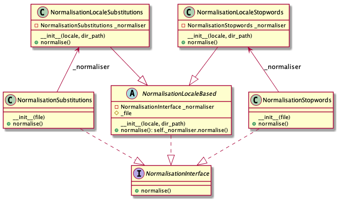

# Language-specific normalisation

* Status: proposed
* Deciders: all
* Date: 2019-01-23
* Original drafter(s): Mike De Smet (VIAA)

## Context and Problem Statement

How do we supply normalisation rules that are different per language?

## Decision Drivers 

* https://github.com/ebu/ai-benchmarking-stt/issues/5

## Proposal

(assumes the structure of [ADR-0001](ADR-0001-normalisation-structure.md).)

Use an abstract class implementing NormalisationInterface for language-specific classes that can automatically determine the resources to load from its appropriate directory. Only the directory where the resources for the Normalisation class is located and the wanted locale are provided, the class determines which available locale file to use automatically using BCP 47.

I propose implementing this according to the decorator pattern so any file based NormalisationInterface can be easily adapted to automatically get the proper localised file, while still having the option to use the Normalisation with a file not based on locale.

### BCP 47

Using [BCP 47](https://tools.ietf.org/html/bcp47) would support most languages and script variations, while offering decent fallback. 

Eg. for a normaliser that provides these files in its directory:

* en
* en-US
* nl-BE
* fr-FR
* sr-Cyrl-RS

Requested language for normalisation | Used language file
------------------------------------ | -------------
sr-Latn-RS | sr-Cyrl-RS
fr-BE | fr-FR
nl-NL | nl-BE
en | en
de | _None/no match_

#### Advantages
* Because it is already a best common practise it is widely recognized, supported, documented and implemented (more or less a solved problem outside the scope of this project that we can re-use)
* Decent fallback rules for not yet implemented language variants

#### Disadvantages
* Might be confusing for users to know which files are actually used when it does a fallback (easily solved by providing a CLI script to output the used files and normalisations for a given configuration and locale string)

### Diagram

The classes extending from `NormalisationLocaleBased` set `_normalizer` in their `__init__` method passing `file=self._file` (which in turn is set by `NormalisationLocaleBased.__init__()` based on `locale` and `dir_path`).

